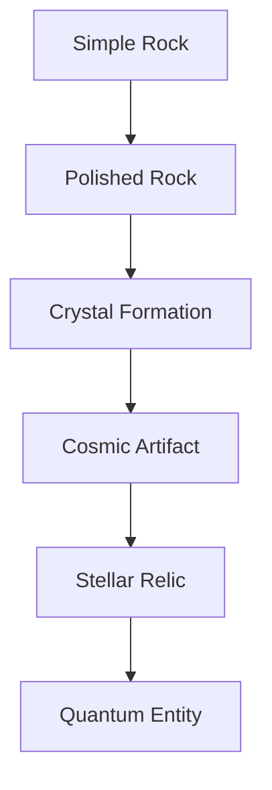

## Evolution Overview

The Evolution System is the heart of Space Rocks' progression mechanics. Transform your collected rocks through multiple tiers, increasing their power, value, and earning potential with each evolution.

## Evolution Path

Your rocks follow a clear progression path from common stones to mythical quantum entities:

### Evolution Tiers

<Steps>
  <Step title="Simple Rock (Common)">
    **Starting Point**
    - Base power: 1-50
    - No special abilities
    - Easy to collect
  </Step>
  
  <Step title="Polished Rock (Uncommon)">
    **First Evolution**
    - Power: 51-150
    - +10% earning boost
    - Visual polish effect
  </Step>
  
  <Step title="Crystal Formation (Rare)">
    **Second Evolution**
    - Power: 151-350
    - +25% earning boost
    - Crystalline appearance
    - Unlock staking
  </Step>
  
  <Step title="Cosmic Artifact (Epic)">
    **Third Evolution**
    - Power: 351-600
    - +50% earning boost
    - Cosmic particle effects
    - Enhanced staking rewards
  </Step>
  
  <Step title="Stellar Relic (Legendary)">
    **Fourth Evolution**
    - Power: 601-850
    - +100% earning boost
    - Stellar glow effects
    - Premium staking tier
  </Step>
  
  <Step title="Quantum Entity (Mythic)">
    **Final Evolution**
    - Power: 851-1000
    - +200% earning boost
    - Quantum visual effects
    - Maximum earning potential
  </Step>
</Steps>

## Evolution Requirements

Each evolution requires specific resources and conditions:

### Resource Requirements

<Tabs>
  <Tab title="Common → Uncommon">
    **Materials Needed:**
    - 1x Base Rock (Common)
    - 2x Catalyst Rocks (Same element)
    - 1x Minor Evolution Stone
    - 100 Meme Coins
    
    **Success Rate:** 95%
    **Time:** Instant
  </Tab>
  
  <Tab title="Uncommon → Rare">
    **Materials Needed:**
    - 1x Base Rock (Uncommon)
    - 3x Catalyst Rocks (Same element)
    - 2x Minor Evolution Stones
    - 500 Meme Coins
    
    **Success Rate:** 85%
    **Time:** 1 hour
  </Tab>
  
  <Tab title="Rare → Epic">
    **Materials Needed:**
    - 1x Base Rock (Rare)
    - 5x Catalyst Rocks (Same element)
    - 1x Major Evolution Stone
    - 2,500 Meme Coins
    
    **Success Rate:** 70%
    **Time:** 6 hours
  </Tab>
  
  <Tab title="Epic → Legendary">
    **Materials Needed:**
    - 1x Base Rock (Epic)
    - 10x Catalyst Rocks (Same element)
    - 3x Major Evolution Stones
    - 10,000 Meme Coins
    
    **Success Rate:** 50%
    **Time:** 24 hours
  </Tab>
  
  <Tab title="Legendary → Mythic">
    **Materials Needed:**
    - 1x Base Rock (Legendary)
    - 20x Catalyst Rocks (Same element)
    - 1x Quantum Evolution Stone
    - 50,000 Meme Coins
    
    **Success Rate:** 25%
    **Time:** 7 days
  </Tab>
</Tabs>

### Evolution Stones

Special items required for evolution:

| Stone Type | Rarity | How to Obtain |
|-----------|--------|---------------|
| Minor Evolution Stone | Common | Daily rewards, quests, shop |
| Major Evolution Stone | Rare | Weekly quests, events, marketplace |
| Quantum Evolution Stone | Mythic | Monthly events, top leaderboard rewards |
| Element-Specific Stones | Varies | Element-themed events |

<Note>
  Evolution Stones can be purchased in the shop, earned through gameplay, or traded on the marketplace.
</Note>

## Evolution Process

### Step-by-Step Evolution

<Steps>
  <Step title="Select Base Rock">
    Choose the rock you want to evolve from your inventory. Check its current stats and evolution requirements.
  </Step>
  
  <Step title="Gather Materials">
    Collect all required catalyst rocks, evolution stones, and meme coins. Materials are consumed during evolution.
  </Step>
  
  <Step title="Choose Boost (Optional)">
    Apply success rate boosters or time accelerators if desired. These increase your chances or speed up the process.
  </Step>
  
  <Step title="Initiate Evolution">
    Confirm the evolution and pay the required costs. The process begins immediately.
  </Step>
  
  <Step title="Wait for Completion">
    Evolution takes time based on the tier. You can speed up with premium currency or wait naturally.
  </Step>
  
  <Step title="Claim Evolved Rock">
    Once complete, claim your evolved rock. If evolution fails, you keep the base rock but lose materials.
  </Step>
</Steps>

### Success Rate Modifiers

Increase your evolution success rate:

<AccordionGroup>
  <Accordion title="Base Rock Power" icon="bolt">
    Higher power level = better success rate
    - Power 1-100: +0%
    - Power 101-300: +5%
    - Power 301-500: +10%
    - Power 501-700: +15%
    - Power 701-1000: +20%
  </Accordion>
  
  <Accordion title="Element Matching" icon="atom">
    Using catalyst rocks of the same element:
    - All same element: +10%
    - Mixed elements: +0%
    - Opposite elements: -10%
  </Accordion>
  
  <Accordion title="Special Traits" icon="sparkles">
    Rocks with special traits get bonuses:
    - Shiny: +5%
    - Ancient: +10%
    - Charged: +15%
    - Blessed: +25%
  </Accordion>
  
  <Accordion title="Boosters" icon="rocket">
    Consumable items that increase success:
    - Minor Booster: +10% (100 coins)
    - Major Booster: +25% (500 coins)
    - Perfect Booster: +50% (2,000 coins)
  </Accordion>
</AccordionGroup>

## Evolution Strategies

### Optimal Evolution Paths

<Tip>
  **Pro Strategy**: Don't rush to evolve every rock. Sometimes it's more profitable to sell multiple common rocks than to evolve them into one rare rock.
</Tip>

#### Conservative Approach

Best for new players:
- Only evolve when success rate is 80%+
- Use boosters on expensive evolutions
- Save catalyst rocks for guaranteed successes
- Focus on one rock at a time

#### Aggressive Approach

For experienced players:
- Evolve with 50%+ success rate
- Mass evolve common rocks
- Take risks on legendary evolutions
- Diversify evolution portfolio

#### Investment Approach

For profit-focused players:
- Calculate expected value before evolving
- Monitor marketplace prices
- Evolve rocks with high demand elements
- Time evolutions with market trends

### Element-Specific Strategies

<CardGroup cols={2}>
  <Card title="Fire Rocks" icon="fire">
    **Best For**: Quick flips
    - High demand in marketplace
    - Lower evolution costs
    - Fast evolution times
  </Card>
  
  <Card title="Water Rocks" icon="droplet">
    **Best For**: Staking
    - Best staking rewards
    - Stable market value
    - Long-term holding
  </Card>
  
  <Card title="Earth Rocks" icon="mountain">
    **Best For**: Budget evolution
    - Reduced material costs
    - Higher success rates
    - Good for beginners
  </Card>
  
  <Card title="Air Rocks" icon="wind">
    **Best For**: Active players
    - Energy regeneration bonus
    - Faster collection cycles
    - Event participation
  </Card>
  
  <Card title="Cosmic Rocks" icon="stars">
    **Best For**: Collectors
    - Unique evolution paths
    - Highest potential value
    - Rarest variants
  </Card>
</CardGroup>

## Failed Evolutions

### What Happens on Failure?

When an evolution fails:

- ✅ **Keep**: Base rock (returns to inventory)
- ❌ **Lose**: All catalyst rocks
- ❌ **Lose**: Evolution stones
- ❌ **Lose**: Meme coin cost
- ⚠️ **Penalty**: Base rock loses 10% power

<Warning>
  Failed evolutions can be costly. Always use boosters on expensive evolution attempts!
</Warning>

### Failure Protection

Protect your investment:

| Protection Type | Effect | Cost |
|----------------|--------|------|
| Material Insurance | Refund 50% of materials | 20% of evolution cost |
| Power Protection | No power loss on failure | 10% of evolution cost |
| Full Protection | Keep all materials + no power loss | 50% of evolution cost |

## Mass Evolution

Unlock mass evolution at Level 30:

### Batch Processing

Evolve multiple rocks simultaneously:

- **Queue System**: Add up to 10 evolutions to queue
- **Parallel Processing**: Process 3 evolutions at once
- **Auto-Retry**: Automatically retry failed evolutions
- **Bulk Discounts**: 10% discount on material costs

### Evolution Presets

Save evolution configurations:

1. **Quick Evolve**: Auto-select cheapest materials
2. **Safe Evolve**: Maximize success rate
3. **Fast Evolve**: Use time accelerators
4. **Profit Evolve**: Optimize for market value

## Special Evolution Events

### Double Success Rate Events

Weekly events with boosted success rates:

- **Monday Madness**: Fire rocks +50% success
- **Tidal Tuesday**: Water rocks +50% success
- **Earthday Wednesday**: Earth rocks +50% success
- **Airy Thursday**: Air rocks +50% success
- **Cosmic Friday**: Cosmic rocks +50% success
- **Weekend Warrior**: All rocks +25% success

### Evolution Tournaments

Compete in evolution challenges:

- **Speed Evolution**: Fastest to evolve 10 rocks
- **Success Streak**: Most consecutive successful evolutions
- **High Roller**: Highest rarity evolution achieved
- **Efficiency Master**: Best resource-to-value ratio

## Evolution Analytics

### Track Your Progress

Monitor evolution statistics:

- **Total Evolutions**: Lifetime evolution count
- **Success Rate**: Personal success percentage
- **Average Cost**: Mean cost per evolution
- **Most Evolved**: Your highest tier rock
- **Element Distribution**: Evolutions by element
- **Profit/Loss**: Net gain from evolutions

### Evolution Calculator

Built-in calculator helps you:

- Estimate evolution costs
- Calculate success probabilities
- Compare evolution paths
- Predict market value
- Optimize material usage

## Advanced Evolution Features

### Fusion Evolution

Combine two rocks of the same tier:

- **Requirements**: 2 rocks of same rarity and element
- **Result**: 1 rock of next tier with combined power
- **Success Rate**: 100% (guaranteed)
- **Cost**: 2x normal evolution cost
- **Benefit**: No material loss risk

### Reverse Evolution

Downgrade rocks for materials:

- **Process**: Convert higher tier to lower tier
- **Returns**: 50% of evolution materials
- **Use Case**: Correct mistakes or get materials
- **Cost**: 10% of original evolution cost
- **Limitation**: Can only reverse once per rock

### Element Conversion

Change a rock's element:

- **Cost**: 5,000 meme coins + Element Stone
- **Success Rate**: 100%
- **Benefit**: Optimize for market demand
- **Limitation**: Once per rock, irreversible

## Tips for Successful Evolution

<Tip>
  **Evolution Mastery Tips:**
  
  1. **Save Boosters**: Use on legendary+ evolutions only
  2. **Time Events**: Evolve during double success rate events
  3. **Power First**: Max out power before evolving
  4. **Element Match**: Always use same-element catalysts
  5. **Insurance**: Protect expensive evolutions
  6. **Calculate ROI**: Ensure evolution increases value
  7. **Patience**: Wait for optimal conditions
  8. **Diversify**: Don't put all resources into one evolution
</Tip>

## Next Steps

<CardGroup cols={2}>
  <Card
    title="Rarity Tiers"
    icon="star"
    href="/game/rarity-tiers"
  >
    Explore detailed rarity tier information
  </Card>
  <Card
    title="Tokenomics"
    icon="coins"
    href="/tokenomics/overview"
  >
    Understand the economic system
  </Card>
  <Card
    title="NFT Minting"
    icon="gem"
    href="/nft/minting-process"
  >
    Learn how to mint evolved rocks as NFTs
  </Card>
  <Card
    title="Marketplace"
    icon="store"
    href="/nft/marketplace"
  >
    Trade your evolved rocks
  </Card>
</CardGroup>
